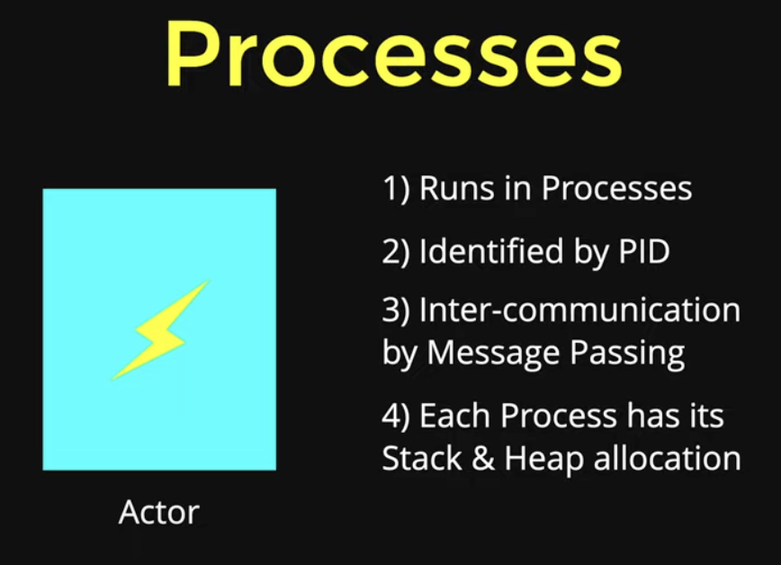
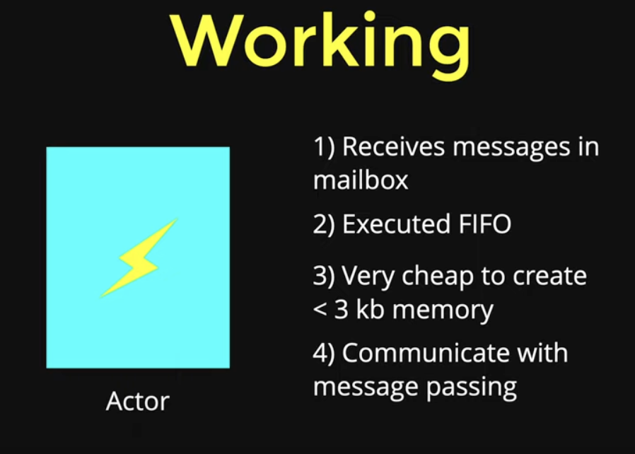
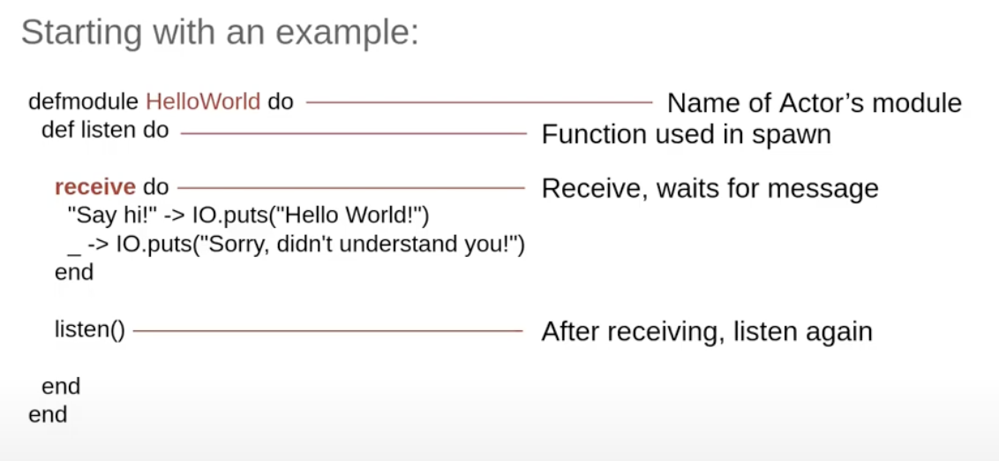
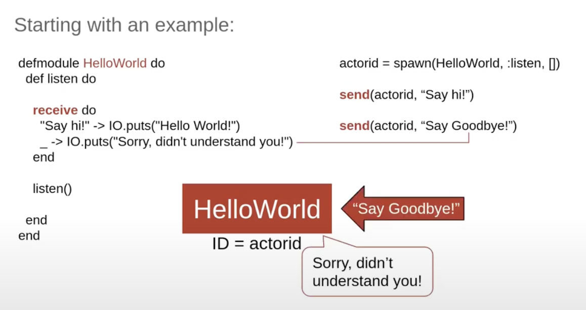

# Actors
In Elixir, `actors` are fundamental to how the language handles `concurrency`, `fault-tolerance`, and `scalability`.

# What Is an Actor in Elixir?
In Elixir (and Erlang), an `actor` is a **lightweight**, **isolated process** that:

- Maintains its own state

- Communicates with other actors via **message passing**

- Does **not share memory**

- Can **crash independently** without affecting others

- Is managed by a **supervisor tree** (for fault tolerance)

These are not OS-level processes — they're **BEAM-level processes**, and you can easily run **millions of them concurrently**.

An Actor is an entity that sends message to other actors. Receives those messages, acts depending on message. Spawns other actors (children). All these done Asynchronously.


# Why use Actors?
1. Lightweight
> In Erlang & Elixir, an actor is called a process. In most env a process is a heavyweight entity that consumes lots of resources and is expensive to create. An Elixir Process, by contrast, is very lightweight - lighter weight even than most systems' threads, both in terms of resources consumption and startup cost.
> Elixir programs typically create thousands of processes without problems and don't normally need to resort to the equivalent of thread pools.

2. Asynchronous with asbtraction
> No need for -
> - Mutex
> - Lock / unlock
> - Semaphores
> - Parallel program planning
> - Shared memory

3. Simple implementation
> Receive and Send
> Actors and Children
> Spawn and spawn_link

4. Robust / Fail-Safe programs.

5. Built-in communications

6. 

# Key Properties of Actors
- Isolation: Each actor is independent and doesn't share state.

- Communication: Actors talk using asynchronous messages.

- Resilience: If an actor crashes, it can be restarted by a supervisor.

- Scalability: BEAM can spawn thousands to millions of processes.


|Concept|	Description|
|--|--|
|Actor|	An isolated BEAM process that handles messages|
|Built| with	spawn, receive or GenServer|
|Advantages|	Concurrency, isolation, fault-tolerance|
|Real Use-Cases|	Chat servers, IoT devices, patient data processing, queues, etc.|

# Understand how code inside Elixir get executed
Here my goal is to undersatnd how all of the the code inside Elixir gets executed.

Now all of the code gets executed in something which is called as an actor.
So we can imageine actor to be something like the box in below diagram, which is an isolated, now this box or so called actor will receives some kind of messages. These messages could be data, could be instructions of what to do with the data and so on. After receiving these messages, the actor is going to process these messages and it simply goign to give back some kind of a response, working as an isolated computation unit.  


Now these actors run inside something which is called as processes and at a given time we can have millions and millions of processes. This is where the data immutability comes into picture. 
We can have millions of copies of our data and they can be distributed across various actors not only on our local machine but we can have a global cluster of different servers and can distribute our load horizintally acorss the globe.

These processes are not OS processes, you can imagine them to be like your virtual threads.



Every Actor has its own mailbox, so every message that you pass to an independent process they are collected inside this mainbox. These messages are executed in a sequential order. and order of execution is FIFO (first-in first-out).  



To check PID (Process ID)
```elixir
iex

> self 
# will see the PID of Elixir's iex.
```
`self` is a function, in elixir either we can write with parantheses or leave then out.


# Example
## Starting with an simple example


In above code snippet, which is a small example of hello world actor. Here we define the name of the actor's module and right under it we define a function that we can use when we spawn our actor. 
We can see that the function is extremely simple, it receives a message with `receive`, and the command waits until a message arrives and after it arrives it pattern matches to the two options that are there, does a command and finishes, at the end we ask it to rerun the function so that it can listen to multiple messages.

So if we spawn a new actor with the command `actorid = spawn(HelloWorld, :listen, [])` with the ID stored in the variale of the return of the spawn function, and we ask him to be created with the `listen()` method. So now when we send the message to the actorid with the "Say hi!", will get the answer as "Hello World!", as that's what the "Say hi!" message matches to. If we send any other value that only matches to the undescore "_" which makes to respond as "Sorry, didn't understand you!" as a return message.



In Elixir, the underscore `_` means pattern match anything else.

## Using Factorial
Refer [code](/Basic/05_actor_factorial.exs)

To run this, 
1. Open terminal.

2. Start IEx and load the file:

```sh
cd Basic/

iex
```

Then in IEx:

```elixir
c("05_actor_factorial.exs")
actorid = spawn(Factorial, :fact, [])
send(actorid, {self(), 5})
receive do
  result -> IO.puts("Factorial is #{result}")
end
```

 


# Project
Refer [ToDo app with actor-based model](/todo_actor_project/) & [Project Info](/Projects.md#extend-todo-project-with-actor-based-model)

This is an extension of our Elixir [ToDo app](/todo_project/) into an actor-based model using GenServer. This design gives me:

- One actor per ToDo list (e.g., per user or per session)

- Isolated state for each list

- Concurrency-safe handling of tasks

- A path toward scalability and fault tolerance with supervision

1. We have below structure after Mix project.

```sh 
todo_actor_project/
├── lib/
│   └── todo_actor_project.ex # Created as a default
│   └── todo_actor.ex     # We'll create this
├── ...
...
```

2. Lets start creating TodoActor module (one actor per list). [todo_actor.ex](/todo_actor_project/lib/todo_actor.ex)

3. Add a registry in your supervision tree.
    Edit [todo_actor_project.ex](/todo_actor_project/lib/todo_actor_project.ex)

    This **Registry** allows us to name each actor uniquely using a `via` tuple.

4. Update `mix.exs` to start your application module and supervision tree.
```sh
def application do
  [
    mod: {TodoActorProject, []},   # <-- Add this line
    extra_applications: [:logger]
  ]
end
```

5. Run & Test in IEx
    From project root, run:
```sh
cd todo_actor_project/

iex -S mix
# It will open Interactive session, do control + c twice to come out.

# recompile and restart your app:
mix compile
iex -S mix
```

Then test it:
```iex
# Start two different lists
{:ok, _pid1} = TodoActor.start_link(:personal)
{:ok, _pid2} = TodoActor.start_link(:work)

# Add tasks
TodoActor.add_task(:personal, "Buy milk")
TodoActor.add_task(:personal, "Read Elixir book")
TodoActor.add_task(:work, "Fix bug")

# Get tasks
TodoActor.get_tasks(:personal)
# => ["Buy milk", "Read Elixir book"]

TodoActor.get_tasks(:work)
# => ["Fix bug"]

{:ok, _pid3} = TodoActor.start_link(:shared)
TodoActor.add_task(:shared, "Clean Home")
TodoActor.add_task(:shared, "Pay Bills")
TodoActor.add_task(:shared, "Grocery Shopping")
```

# References
[Unpacking Elixir: The Actor Model](https://underjord.io/unpacking-elixir-the-actor-model.html)

[Simulations with Elixir and the Actor Model](https://blog.finiam.com/blog/simulations-with-elixir-and-the-actor-model)

[A Brief Introduction to Elixir's Actors Model](https://www.youtube.com/watch?v=DhhFHwN1XjY)

[Elixir Processes & The Actor Model](https://www.youtube.com/watch?v=dU3_FQLaYPw)

[10 Actor Model in Elixir | Full Course - Complete Beginner Tutorial](https://www.youtube.com/watch?v=0czi_ARszsE)