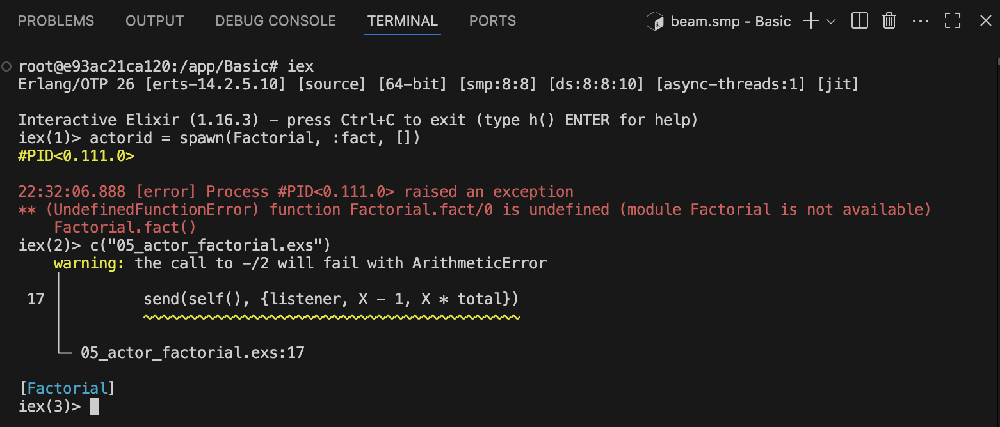

# Warnings

Below is the code I used initially for [Factorial](/Basic/05_actor_factorial.exs)

```elixir
defmodule Factorial do
  def fact do
    receive do
      # {:message_type, value} ->
        # code

      {listener, X} ->
        send(self(), {listener, X, 1})

      {listener, 0, total} ->
        send(listener, total)

      {listener, 1, total} ->
        send(listener, total)

      {listener, X, total} ->
        send(self(), {listener, X - 1, X * total})
    end

    fact()

  end
end
```

Will get below warning


**What does this means:**

The warning means that when X becomes 0, the code will still try to compute X - 1 and X * total, which is fine for multiplication, but you should ensure your recursion stops at 0 or 1 to avoid unnecessary calls.

Your code already handles {listener, 0, total} and {listener, 1, total} by sending the result to the listener. The warning is just letting you know that if X is not an integer or is negative, X - 1 could cause issues.

No change is strictly required for normal positive integer inputs.
If you want to silence the warning and make the code safer, you can add a guard to ensure X > 1 before recursing:

```elixir
defmodule Factorial do
  def fact do
    receive do
      {listener, X} when X > 1 ->
        send(self(), {listener, X - 1, X * 1})
      {listener, X} ->
        send(self(), {listener, X, 1})

      {listener, 0, total} ->
        send(listener, total)

      {listener, 1, total} ->
        send(listener, total)

      {listener, X, total} when X > 1 ->
        send(self(), {listener, X - 1, X * total})
    end

    fact()
  end
end
```

To smuuarize, the warning is informational. Above code works for positive integers.
For robustness, add guards to ensure X > 1 before recursing.
