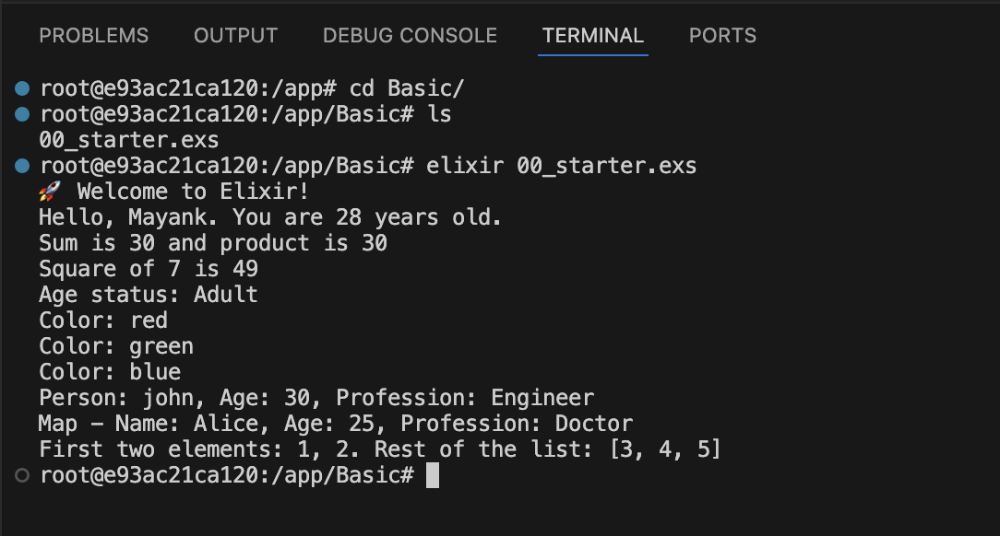
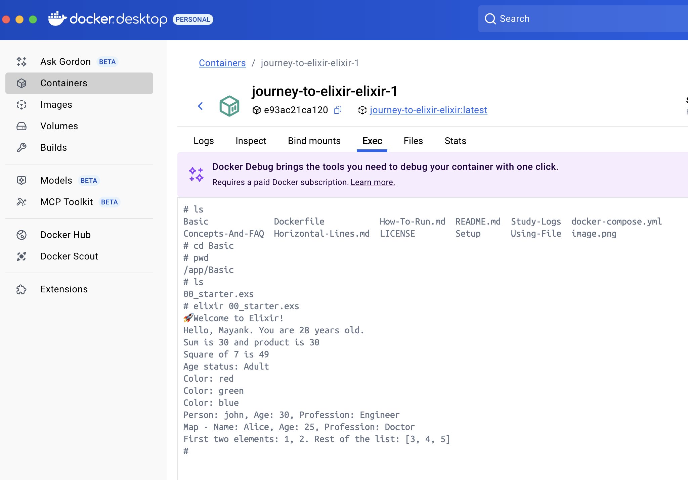

# How to Run the Elixir File

To run the file [00_starter](/Basic/00_starter.exs).

From your terminal or inside the Docker container:

```sh
# Check what folder you are in, and if require navigate to the Basic folder, as the file exists there.
cd Basic/

elixir 00_starter.exs
```

From Terminal: 




From Docker Container:



Similar to `00_starter.exs`, run the other files in this directory.

# Different ways to execute elixir file 
Learn how to run the file, [Refer](Ways-To-Runs.md).