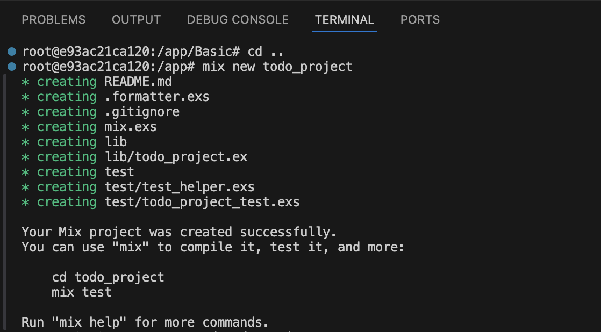

# Working on a Project
Now I am ready to move from [basic](/Basic/) Elixir scripting to building my first real project — a [ToDo app](/todo_project/) — using `mix`, the standard Elixir build tool. 

Let's break this down step by step so you can build the project with me in an isolated directory ([todo_project](/todo_project/)) without breaking the existing files.

# Setup
## 1. Create the Project
From inside the container shell or using VS Code terminal (opened in container):

```sh
cd ..  # adjust path if needed

mix new todo_project
```



This generates:
```sh
todo_project/
├── lib/
│   └── todo_project.ex
├── test/
|   └── test_helper.exs
│   └── todo_project_test.exs
├── .formatter.exs
├── mix.exs
└── README.md
```

## 2. Running and Testing the Project
From within the `todo_project/` folder:

```sh
cd todo_project
iex -S mix
```

This starts the Elixir shell and loads your project. You can now add modules, test things, and call functions inside IEx.

## 3. Modify Dockerfile (Minimal or None Required)
The existing Dockerfile is mostly fine. Just ensure it can run `mix` (it can already if using `elixir:1.16`).

My Dockerfile already includes:

```Dockerfile
RUN mix local.hex --force && \
    mix local.rebar --force
```

That’s all we need for mix.

## 4. Modify docker-compose.yml (optional: mount todo_project)
If you want to work on `todo_project` specifically and ensure it's mounted:

```sh
services:
  elixir:
    build:
      context: ../
      dockerfile: Setup/Dockerfile
    volumes:
      - ../todo_project:/app/todo_project
    working_dir: /app/todo_project
    command: iex -S mix
```

But this is only needed if you want a separate container just for the project.

⚠️ Otherwise, no changes are needed to existing `docker-compose.yml`. We're already in a dev container with access to the full repo.

## 5. Modify `.devcontainer/devcontainer.json`
Again, optional — only needed if you want to open VS Code directly in todo_project/ as default:

```json
"workspaceFolder": "/workspaces/Journey-to-elixir/todo_project"
```
⚠️ This affects only the default directory opened in VS Code when the container starts. It does not break anything else.


# Will This Break Existing Files?
No ❌. You’re working in a new, clean `todo_project/` folder. Nothing we do here affects your:

- Basic/
- Existing .exs scripts
- Docker setup

Everything is sandboxed and organized.

# Code for Project
Now we have setup the project structure & project, and ready with it, lets start coding.

## ToDo Logic (Start Simple)
Inside `lib/todo_project.ex`, replace content with:

```elixir
defmodule TodoProject do
  def new_list, do: []

  def add_task(list, task), do: list ++ [task]

  def show_tasks(list) do
    Enum.each(list, fn task -> IO.puts("- #{task}") end)
  end
end
```

## Run
Try it in IEx:

```sh
list = TodoProject.new_list()
list = TodoProject.add_task(list, "Buy milk")
TodoProject.show_tasks(list)
```

If fails with error as below
```sh
** (UndefinedFunctionError) function TodoProject.new_list/0 is undefined or private
    (todo_project 0.1.0) TodoProject.new_list()
    iex:3: (file)
```

That error means that Elixir cannot find a public function called new_list/0 in the TodoProject module — likely because:

 - The module wasn’t recompiled after you made code changes.

 - The function is defined as defp (private) instead of def.

 - You're not in the right project directory (or the file wasn't saved).

 - The IEx session was started before the function existed.

 ### Fix
 1. Make sure you saved the file.
 Edit `lib/todo_project.ex` and make sure it looks [like](#todo-logic-start-simple).

 2. Recompile the module in IEx
 If you're already in IEx, you can reload the module like this:
```sh
recompile()
```
If that doesn't work, quit (Ctrl+C, then a) and restart:
```sh
iex -S mix
```

3. Try again in IEx
```sh
list = TodoProject.new_list()
list = TodoProject.add_task(list, "Learn Elixir")
TodoProject.show_tasks(list)
```

