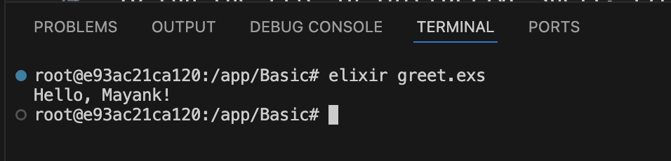
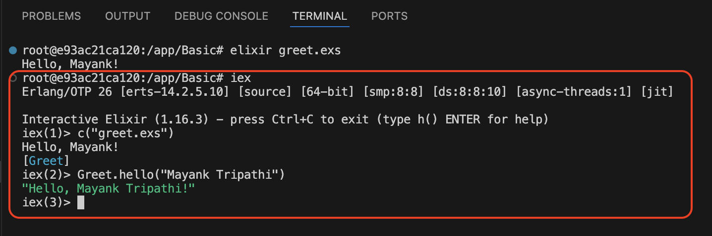
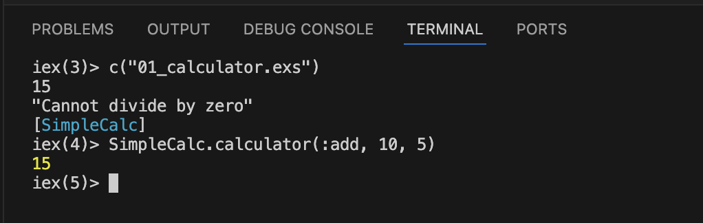
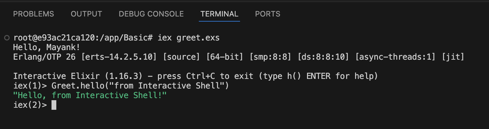

# Ways to Run Elixir File

Running Elixir files can be done in multiple ways depending on your goal (quick script, interactive dev, full app, etc.).

# 1. Using elixir Command (Script Mode)

```sh
elixir my_file_name.exs
```

- Runs the file as a script from top to bottom.

- Typically used for small scripts or quick testing.

- Executes anything outside of functions/modules.

Example:
```elixir
# greet.exs
defmodule Greet do
  def hello(name), do: "Hello, #{name}!"
end

IO.puts Greet.hello("Mayank")
```

Run the file
```sh
$ elixir greet.exs
Hello, Mayank
```



Also refer [Run Elixir File](How-To-Run.md#how-to-run-the-elixir-file)

# 2. Using `iex` to Load File Interactively
To run the file in Interactive shell, first need to connect to it using `iex` command as below.

```sh
iex
iex> c("greet.exs")
iex> Greet.hello("Mayank Tripathi")
```



- Loads the file and compiles the module in memory.

- Good for testing and experimenting with functions.

- Functions can be called interactively.

Sample screenshot:



# 3. Start IEx With File Preloaded

```sh
iex greet.exs
```

```elixir
iex> Greet.hello("from Interactive Shell")
```



- Loads the file and opens IEx right after.

- Code outside defmodule will execute immediately.

- Then you can interact with loaded modules/functions.


# 4. Using mix Project Structure (For Bigger Apps)
If you create a project using:

```sh
mix new my_app
```

You can:

- Place code in `lib/`

- Use `mix compile` to compile it

- Run with `iex -S mix` to load everything and use interactively

- This is best for production-quality code.

# 5. Compile and Run the Script
We can compile and run the script, for this will use command `elixirc`. This is similart to [using elixir command](#1-using-elixir-command-script-mode).

Notice the difference after running the command, as it will create a new compiled file as `Elixir.<>ModuleName>.beam`. Normally we don't compile and run the Elixir files like this, we should use the [mix tool](/Concepts-And-FAQ/mix-new-project.md). 

Run from Terminal:
```sh
elixirc hello.exs


```

# Summary

|Method	|Command	|Use Case|
|--|--|--|
|Script Mode	|`elixir my_file.exs`	|Run top-to-bottom script|
|Load in IEx	|`c("file.exs")`	|Compile and play with modules|
|Ex with File	|`iex file.exs`	|Run file and stay in REPL|
|Mix Project	|`mix new`, `iex -S mix`	|For real apps and structured code|


